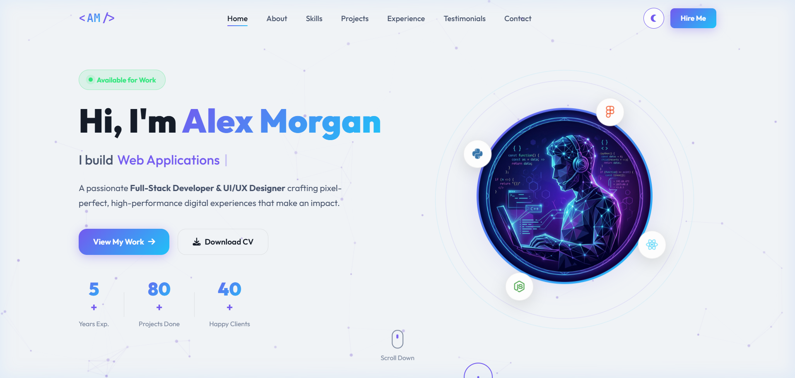
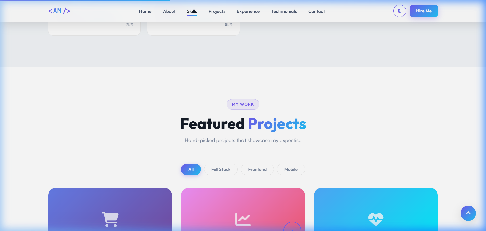
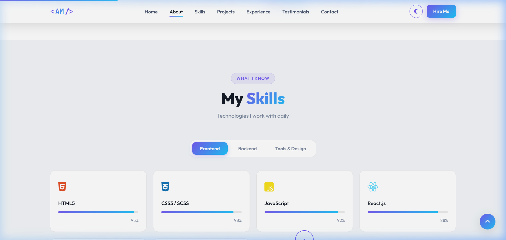
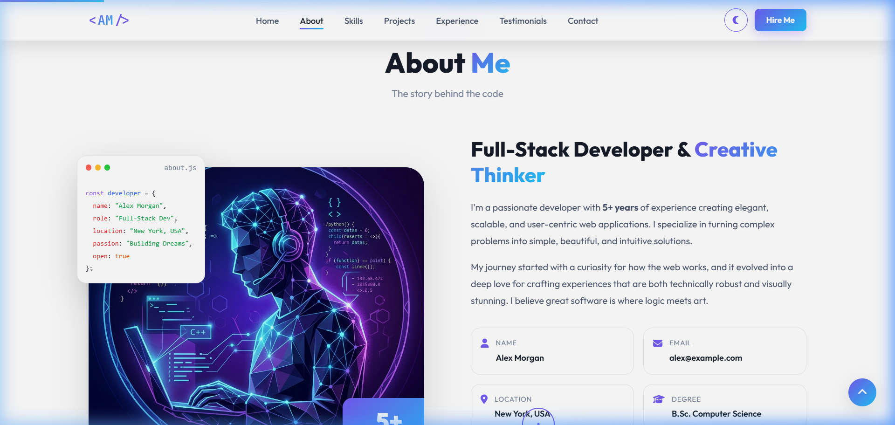

<div align="center">
  <h1>🚀 Foliofy: Dynamic Portfolio System</h1>
  <p><strong>A Next-Generation, Data-Driven Personal Portfolio & Admin Dashboard</strong></p>
  
  <p>
    
    
    
    
  </p>
</div>

<br />

## 🌟 Overview

**Foliofy** is a state-of-the-art, fully dynamic portfolio template designed for developers, designers, and creatives who want to showcase their work brilliantly with zero maintenance overhead. Built using vanilla web technologies (HTML, CSS, JS), it scales elegantly from a simple static site to a fully synced GitHub portfolio.

The ecosystem includes a beautiful front-end displaying your projects, skills, and experience, paired with a dedicated **Admin Interface** (`admin.html`) enabling seamless configuration. The system dynamically reads from a centralized `data.js` file, meaning you only have to update a single file (or use the built-in admin panel) to update your entire portfolio instantly.

---

## ✨ Key Features

- **🔄 GitHub Synchronization Ready**: Architected to synchronize and parse READMEs from all your GitHub repositories, ensuring every single project is dynamically displayed without manual copy-pasting.
- **🎛️ Integrated Admin Dashboard**: A sleek, easy-to-use admin panel (`admin.html`) to manage skills, experience, projects, and personal data securely and efficiently.
- **🌗 Dark/Light Mode Engine**: Seamless client-side theme switching with persistent local storage.
- **🎨 Premium Animations & UI**: Packed with micro-interactions, smooth AOS-powered scroll animations, Swiper.js carousels, and an immersive custom cursor.
- **📱 Fully Responsive**: Pixel-perfect scaling on desktop, tablet, and mobile devices.
- **⚡ Blazing Fast Performance**: Zero-build-step vanilla JavaScript rendering engine (`renderer.js`) ensuring minimal overhead and maximum SEO reach.

---

## 🛠️ Architecture & Tech Stack

Foliofy is proudly built using modern web standards without enforcing heavy frontend frameworks:

- **Frontend Core**: HTML5, Vanilla JavaScript (ES6+), Vanilla CSS3 / SCSS methodologies
- **Dynamic Rendering**: Custom templating via `renderer.js` extracting state from `data.js`
- **Libraries & Assets**: 
  - [AOS (Animate On Scroll)](https://michalsnik.github.io/aos/) for scroll reveals
  - [Swiper.js](https://swiperjs.com/) for touch-friendly carousels
  - [Font Awesome 6](https://fontawesome.com/) for crisp vector icons
  - [Google Fonts](https://fonts.google.com/) (Outfit & JetBrains Mono)

---

## 🚀 Getting Started

### 1. Installation

Getting your portfolio up and running requires no build steps or bundlers. Simply clone the repository and open the index file.

```bash
# Clone the repository
git clone https://github.com/yasirraheel/foliofy.git

# Navigate into the project directory
cd foliofy
```

### 2. Running Locally

Since Foliofy uses vanilla web technologies, you can serve it using any local web server, or simply by opening `index.html` in your browser. 

*(If you are utilizing GitHub API calls or ES modules, using a simple local server like Live Server for VSCode is recommended to avoid CORS issues).*

### 3. Customizing Your Data

All portfolio data is securely decoupled from the UI. To customize the portfolio:
1. Open `data.js` in your favorite editor.
2. Update the JSON objects to reflect your personal details, skills, experiences, and specific GitHub repository data.
3. Refresh your browser to view the changes rendered instantly via `renderer.js`.

---

## ⚙️ The Admin Dashboard

Foliofy includes a secret weapon: **The Admin Editor**. 

Navigate to `admin.html` in your browser to access the control center. From here, you can visually update your portfolio strings, add new projects, tweak your theme configurations, and export your validated schema back into `data.js`.

---

## 📸 Screenshots

*(Replace these with direct links to your screenshots if hosted externally)*

| Hero Display | Projects Section |
|:---:|:---:|
|  |  |

| Skills Overview | About Section |
|:---:|:---:|
|  |  |

---

## 🤝 Contributing

While Foliofy was built as a personal portfolio system, forks and contributions are welcome! If you have ideas on how to make the GitHub synchronization even more robust or the admin UI smoother:

1. Fork the Project
2. Create your Feature Branch (`git checkout -b feature/AmazingFeature`)
3. Commit your Changes (`git commit -m 'Add some AmazingFeature'`)
4. Push to the Branch (`git push origin feature/AmazingFeature`)
5. Open a Pull Request

---

## 📝 License

Distributed under the MIT License. See `LICENSE` for more information.

---

<div align="center">
  <p>Built with ❤️ by <strong>Yasir Raheel</strong></p>
  <p>
    <a href="https://github.com/yasirraheel">GitHub</a> •
    <a href="#">LinkedIn</a> •
    <a href="#">Twitter</a>
  </p>
</div>
